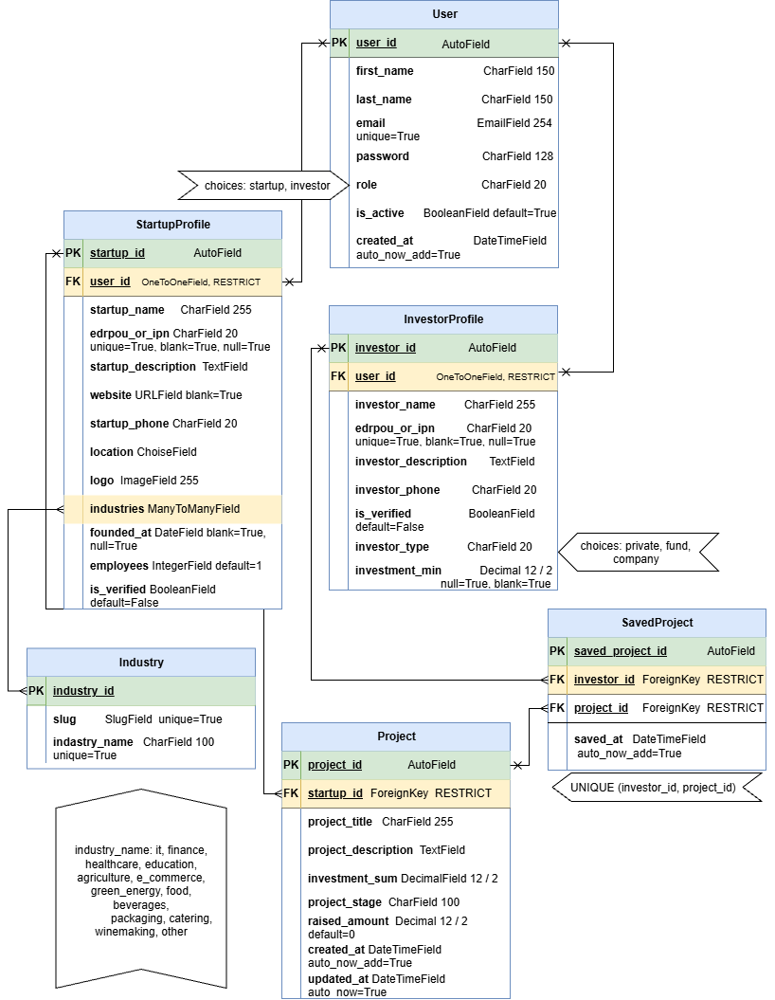

# Forum-Project-Stage-CC

[](https://github.com/ITA-Dnipro/PL4851/actions/workflows/ci.yml?query=branch%3Adevelop)
[](https://app.codecov.io/gh/ITA-Dnipro/PL4851)
[](https://github.com/psf/black)
[](https://github.com/pre-commit/pre-commit)

Forum Project Stage CC Template Repo

**Project Vision Statement:**

*"Empowering Innovation: Bridging Startups and Investors for Ukraine's Economic Growth"*

**Overview:**

In the dynamic world of entrepreneurship, the path from a transformative idea to a successful venture is often complex and challenging. Our WebAPI application, developed using the Django Rest Framework, is designed to be a cornerstone in simplifying this journey. We aim to create a robust and secure digital platform that caters to two pivotal groups in the business ecosystem: innovative startups with compelling ideas and forward-thinking investors seeking valuable opportunities.

**Goals:**

1. **Fostering Collaborative Opportunities:** Our platform bridges startups and investors, enabling startups to showcase their groundbreaking proposals and investors to discover and engage with high-potential ventures.

2. **Seamless User Experience:** We prioritize intuitive navigation and interaction, ensuring that startups and investors can easily connect, communicate, and collaborate.

3. **Secure and Trustworthy Environment:** Security is at the forefront of our development, ensuring the confidentiality and integrity of all shared information and communications.

4. **Supporting Economic Growth:** By aligning startups with the right investors, our platform not only cultivates individual business success but also contributes significantly to the growth and diversification of Ukraine's economy.

**Commitment:**

We are committed to delivering a platform that is not just a marketplace for ideas and investments but a thriving community that nurtures innovation fosters economic development, and supports the aspirations of entrepreneurs and investors alike. Our vision is to see a world where every transformative idea has the opportunity to flourish and where investors can confidently fuel the engines of progress and innovation.





### Basic Epics

0. **As a user of the platform**, I want the ability to represent both as a startup and as an investor company, so that I can engage in the platform's ecosystem from both perspectives using a single account.

   - Features:
     - implement the functionality for users to select and switch roles.

2. **As a startup company,** I want to create a profile on the platform, so that I can present my ideas and proposals to potential investors.

   - Features:
     -  user registration functionality for startups.
     -  profile setup page where startups can add details about their company and ideas.

3. **As an investor,** I want to view profiles of startups, so that I can find promising ideas to invest in.

   - Features:
     -  feature for investors to browse and filter startup profiles.
     -  viewing functionality for detailed startup profiles.

4. **As a startup company,** I want to update my project information, so that I can keep potential investors informed about our progress and milestones.

   - Features:
     -  functionality for startups to edit and update their project information.
     -  system to notify investors about updates to startups they are following.

5. **As an investor,** I want to be able to contact startups directly through the platform, so that I can discuss investment opportunities.

   - Features:
     -  secure messaging system within the platform for communication between startups and investors.
     -  privacy and security measures to protect the communication.

6. **As a startup company,** I want to receive notifications about interested investors, so that I can engage with them promptly.

   - Features:
     -  notification functionality for startups when an investor shows interest or contacts them.
     -  dashboard for startups to view and manage investor interactions.

7. **As an investor,** I want to save and track startups that interest me, so that I can manage my investment opportunities effectively.

   - Features:
     -  feature for investors to save and track startups.
     -  dashboard for investors to manage their saved startups and investment activities.

### Additional Features

- **Security and Data Protection**: Ensure that user data, especially sensitive financial information, is securely handled.

- **User Feedback System**: Create a system for users to provide feedback on the platform, contributing to continuous improvement.

- **Analytical Tools**: Implement analytical tools for startups to understand investor engagement and for investors to analyze startup potential.

### Agile Considerations

- Each user story can be broken down into smaller tasks and developed in sprints.
- Regular feedback from both user groups (startups and investors) should be incorporated.


## Local Development with Docker

### Prerequisites

- Docker Desktop
- Docker Compose

### Environment Setup

Create a local `.env` file from `.env.example`:

```powershell
Copy-Item .env.example .env
```

Update the values in `.env` if necessary.

### Run the Project

Build and start all services:

```powershell
docker compose up --build
```

This starts:

- Frontend: http://localhost:5173
- Backend: http://localhost:8000
- PostgreSQL: localhost:5432

### Database Migrations

After the containers are running, open another terminal and run:

```powershell
docker compose exec backend python manage.py migrate
```

### Initial Content

Load the initial landing content (see [backend/README.md](backend/README.md#landing-content)):

```powershell
docker compose exec backend python manage.py loaddata landing
```

This is enough for the frontend to get data from `GET /api/content/landing/`.

### Admin Panel (optional)

To edit content in the admin, create an admin user:

```powershell
docker compose exec backend python manage.py createsuperuser
```

Then open http://localhost:8000/admin/

### Backend Health Check

Open:

http://localhost:8000/api/health/

A working backend should return:

```json
{
  "status": "ok"
}
```

### Stop the Project

To stop all containers:

```powershell
docker compose down
```


### Code Style & Linting


Checks run automatically on `git commit` via [pre-commit](https://pre-commit.com/) hooks (config: `.pre-commit-config.yaml`).

| Part | Tools | Config |
|---|---|---|
| Backend | black (formatting), isort (imports), flake8 + flake8-quotes (lint) | `backend/pyproject.toml`, `backend/.flake8` |
| Frontend | ESLint | `frontend/eslint.config.js` |
| Any file | trailing whitespace, end of file, YAML syntax, merge conflicts, large files | `.pre-commit-config.yaml` |
| GitHub config | `.github/dependabot.yml` and workflows validated against their schemas (check-jsonschema) | `.pre-commit-config.yaml` |

Style rules: line length 88, **single quotes** in Python (black keeps quotes as written, flake8-quotes enforces single).

#### Setup

Install pre-commit globally, once per machine (it does not depend on the backend venv or Docker):

```bash
# with uv (works on Linux, macOS and Windows; uv downloads Python itself if needed)
uv tool install pre-commit

# or, if Python is already installed
pipx install pre-commit         # or: pip install --user pre-commit
```

Check: `pre-commit --version`.

Then, once per clone, from the repo root:

```bash
pre-commit install

# frontend dependencies are needed for the ESLint hook
npm --prefix frontend install
```

Hooks install their own isolated copies of black, isort and flake8 (versions pinned in `.pre-commit-config.yaml`). To run these tools manually or get them in your IDE, install `backend/requirements-dev.txt` into the backend venv (see `backend/README.md`).

#### Run manually

```bash
pre-commit run --all-files      # all hooks on the whole repo

# or individual tools
cd backend && black . && isort . && flake8
cd frontend && npm run lint
```

If a hook modifies files (black, isort, end-of-file-fixer), the commit is stopped: review the changes, `git add` them and commit again.

### Continuous Integration

GitHub Actions workflow `.github/workflows/ci.yml` runs on every pull request and push to `develop` and `main`. It has two jobs that run in parallel:

| Job | Steps |
|---|---|
| Backend (lint + tests) | black, isort, flake8, missing migrations check, pytest (against PostgreSQL 17) |
| Frontend (lint + tests + build) | ESLint, Vitest (`npm run test:run`, once the frontend has tests), `npm run build` (TypeScript check + Vite build) |

Both checks must be green before merging.

#### Reading CI logs

1. Open the PR and scroll to the checks block at the bottom (or open the **Checks** tab).
2. A failed job is marked with a red ❌. Click **Details** next to it.
3. The job page lists its steps; the failed one is expanded. Its name tells what failed (e.g. `flake8`, `pytest`, `Build`).
4. Read the step output: linters print the file, line and rule; black and isort print a diff of what they would change; pytest prints the failing test and traceback.
5. Reproduce locally with the same command, fix, push again. CI reruns automatically, and an older run of the same branch is cancelled.

Most lint failures are fixed locally by `pre-commit run --all-files`. Tests: `cd backend && pytest`.

### Testing & Coverage (Backend)

Tests are written using `pytest` and `pytest-django`. All tests are centralized inside the `backend/tests/` directory.

#### Running Tests

Make sure you are in the `backend` directory:

```bash
cd backend
```

Run all tests:
`pytest`

Run tests by marker:
`pytest -m api`

`pytest -m models`

#### Coverage Reports

`./scripts/run_coverage.sh`

To rerun a job without a new commit (e.g. a flaky network error), use **Re-run jobs** on the workflow run page.

### Code Coverage (Codecov)

The backend CI job runs pytest with coverage and uploads the report (`backend/coverage.xml`) to [Codecov](https://app.codecov.io/gh/ITA-Dnipro/PL4851). On every PR Codecov posts a comment with the coverage change and adds two checks, `codecov/project` and `codecov/patch`. For now they are informational: they never fail a PR (see `codecov.yml`).

#### Codecov token

The upload token is stored as the repository secret `CODECOV_TOKEN` (**Settings → Secrets and variables → Actions**). To replace it (repo admin): copy the upload token from the repository's page on Codecov (**Configuration → General**) and update the secret.

If an upload fails (e.g. Codecov is down), the **Upload coverage to Codecov** step logs an error but doesn't fail the job (`fail_ci_if_error: false`). PRs opened by Dependabot can't read the secret, so their coverage isn't uploaded.

### Dependency Updates (Dependabot)

[Dependabot](https://docs.github.com/en/code-security/dependabot) keeps dependencies up to date (config: `.github/dependabot.yml`). Every Monday it checks for new versions and opens PRs into `develop`:

| Ecosystem | Files | PRs |
|---|---|---|
| GitHub Actions | `.github/workflows/*.yml` | one PR for all actions |
| pip | `backend/requirements*.txt` | one PR with all minor and patch updates, a separate PR per major update |
| npm | `frontend/package.json`, `frontend/package-lock.json` | same as pip |

- pip and npm releases are proposed only when they are at least 5 days old (`cooldown`): broken or compromised releases are usually withdrawn by then.
- black, isort, flake8 and flake8-quotes are excluded because they are also pinned in `.pre-commit-config.yaml`. Update them by hand in both files at once, so CI and the git hooks run the same versions.

Reviewing a Dependabot PR:

1. Wait for CI. Green CI means the project still installs, builds and passes tests with the new versions.
2. For a major update, read the release notes in the PR description and check that the app still works locally.
3. Merge it like any other PR. If it has conflicts with `develop`, comment `@dependabot rebase`.
4. Not ready for a major version yet (e.g. a new Django)? Comment `@dependabot ignore this major version` and close the PR.

After pulling a change to `frontend/package*.json`, reinstall dependencies: `npm --prefix frontend install`, or with Docker `docker compose up --build -V` (`-V` recreates the container's `node_modules`).

If `.github/dependabot.yml` has an error, GitHub shows it in **Insights → Dependency graph → Dependabot**. The `check-dependabot` pre-commit hook catches most errors before commit.

### Security

- Never commit secrets. `.env` files are gitignored; only `.env.example` with placeholder values goes to the repo. CI secrets (e.g. `CODECOV_TOKEN`) are stored in **Settings → Secrets and variables**.
- Outside local development, set a unique `SECRET_KEY`, `DEBUG=False` and real `ALLOWED_HOSTS` through environment variables. `python manage.py check --deploy` lists what else to fix.
- Repo admins should enable in **Settings → Advanced Security** (*Code security* in the older UI):
  - **Dependabot alerts**: a warning in the **Security** tab when a dependency has a known vulnerability;
  - **Dependabot security updates**: a fix PR right away, without waiting for the weekly run or the cooldown;
  - **Secret scanning** with **push protection**: blocks pushes that contain tokens or passwords.
- Found a vulnerability? Don't open a public issue: report it privately to the maintainers, or via **Security → Report a vulnerability** if private reporting is enabled.
